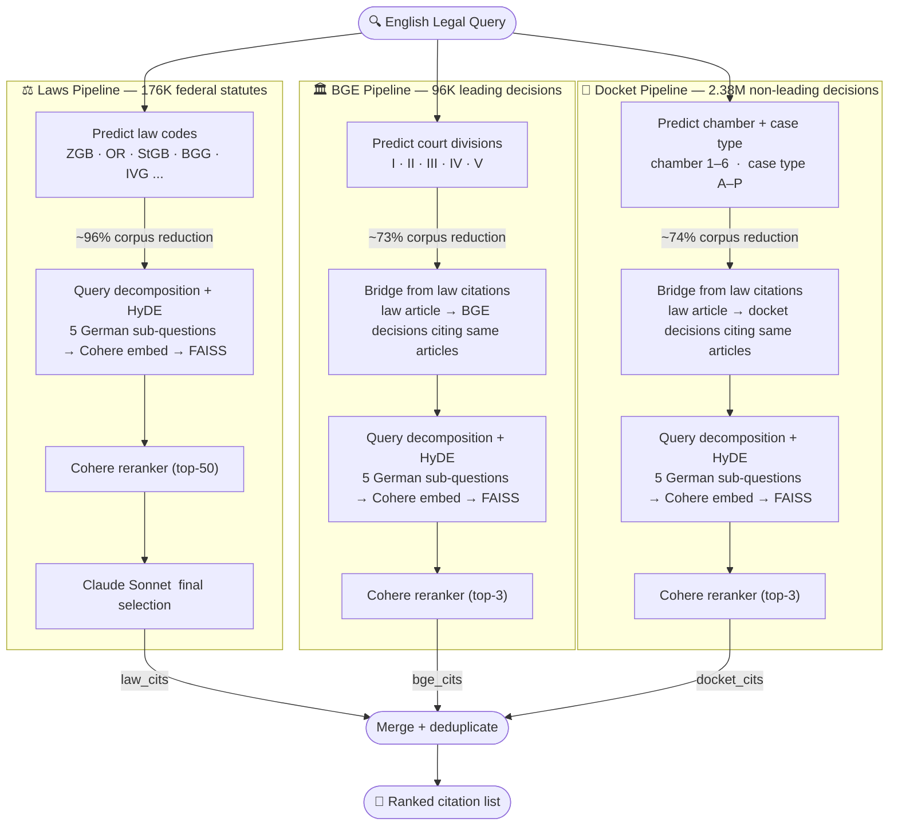

<div align="center">

# Swiss Legal Information Retrieval

### Multi-Stage RAG Pipeline for Swiss Law · Cross-Lingual · 2.65M+ Documents

[](https://www.python.org/downloads/)
[](https://aws.amazon.com/bedrock/)
[](https://github.com/facebookresearch/faiss)
[](https://cohere.com/)
[](https://kaggle.com/competitions/llm-agentic-legal-information-retrieval)

</div>

---

> Given an English legal question, the system retrieves the most relevant Swiss legal citations across statutes, leading court decisions, and non-leading case-law — from a corpus of 2.65M+ documents spread across German, French, and Italian.

Built for the [LLM Agentic Legal Information Retrieval](https://kaggle.com/competitions/llm-agentic-legal-information-retrieval) Kaggle competition hosted by [Omnilex](https://omnilex.ai).

---

## 1. Architecture

Three independent retrieval pipelines, each targeting a distinct slice of Swiss law, feed a final merge step.



---

## 2. Key Technique: Cascading Metadata Filtering

The central design insight is to drastically shrink the search space **before** any expensive operation — embedding, FAISS search, or reranking.

Before touching a single document text, the LLM predicts structured metadata from the input query and filters the corpus using only the citation strings themselves:

| Pipeline | Metadata predicted | Corpus size | Avg reduction |
|---|---|---|---|
| Laws | Law codes (ZGB, OR, StGB, BGG, ...) | 176K | ~96% |
| BGE | Court divisions (I–V) | 96K | ~73% |
| Docket | Chamber (1–6) + case type letter | 2.38M | ~74% |

**Why this matters:** A 74% reduction on 2.38M docket rows cuts the candidate space to a much smaller retrieval slice before retrieval begins. This cascades into every downstream step — the reranker only sees a fraction of candidates, FAISS searches a filtered index, and the final LLM selector receives a short, high-signal list. The result is lower cost, lower latency, and higher precision throughout the pipeline.

**Why it works:** Swiss law is structurally encoded in citation identifiers. Each statute has a canonical abbreviation (`OR`, `StGB`, `IVG`), each Federal Court division handles a specific legal domain, and every docket number encodes the chamber and case type. An LLM can reliably recover these fields from an English legal question — and this requires no document text at all, just the citation string.

---

## 3. Design Decisions

### Why three separate pipelines?

The three corpora have fundamentally different sizes and structures, so each benefits from a different retrieval strategy:

- **Laws (176K)** are short, article-level snippets with canonical German abbreviations — well-suited for a compact FAISS flat index with metadata pre-filtering by law code.
- **BGE (96K)** are multilingual court consideration texts structured by court division — dense retrieval with division-aware filtering and cross-lingual HyDE embeddings fits naturally.
- **Docket (2.38M)** is an order of magnitude larger than BGE, so it is kept as its own dense retrieval pipeline with metadata filtering before vector search, while leaving approximate indexing and stronger scaling work for future improvement.

Keeping pipelines separate also means each can be tuned, replaced, or scaled independently.

### Query decomposition for laws

Law articles are narrow and precise — each article governs a specific rule. A legal question, however, spans multiple aspects: the substantive rule, the procedural requirement, the constitutional basis, the remedies. A single query embedding averages all of these into one vector, reducing precision for any individual article.

The solution: decompose the query into 5 focused German sub-questions, one per legal angle, each paired with a hypothetical statute-style answer (HyDE). Each pair is embedded and searched independently, ensuring every distinct legal aspect gets its own targeted retrieval pass.

### HyDE for BGE and docket

Both BGE and docket pipelines use German HyDE query decomposition with Cohere multilingual embeddings. The embeddings are language-agnostic at the vector level — a German HyDE text correctly matches French and Italian court decisions without needing separate per-language queries. The semantic space handles cross-lingual retrieval implicitly.

### Why keep BGE and docket as separate pipelines?

BGE decisions (96K leading decisions) and docket decisions (2.38M non-leading decisions) are structurally different — BGE decisions are authoritative, well-structured, and highly cited, while docket decisions are shorter, procedural, and more case-specific. Merging them into a single index would cause the 2.38M docket rows to drown out the relatively small BGE corpus in retrieval results, even with metadata pre-filtering. Separate pipelines ensure each type of decision gets its own ranked retrieval pass.

---

## 4. Example

**Input query (English):**

> Mr. Dalton, born in 1941 and resident in a small lakeside town near Thun, executed a handwritten will on 10 October 1997 stating that he left his entire estate to his partner Ms. Lang and, should she predecease him, to his granddaughters Anna (born 1988) and Bella (born 1991). Mr. Dalton and Ms. Lang died in 2010 in an alpine avalanche; Dalton's surviving half-siblings and a cousin contest the validity of the 10 October 1997 handwritten instrument, alleging that Dalton did not have sufficient command of German and therefore could not have composed a testamentary text containing legal terms such as bequeath or legatee, so the document does not reflect his true intention. Under the Civil Code, does this handwritten (holographic) will meet the formal requirements (including where there is a suspicion that parts of the text may have been added by a third party), must Dalton's testamentary capacity at the time of drafting be regarded as lacking, and are doubts about the testator's language comprehension or vocabulary alone sufficient to annul or to reinterpret the testamentary dispositions in favour of relatives not named in the will?

**Retrieved citations (German corpus):**

```
# Swiss Civil Code statutes
Art. 469 Abs. 1 ZGB
Art. 469 Abs. 2 ZGB
Art. 469 Abs. 3 ZGB
Art. 519 Abs. 1 ZGB
Art. 519 Abs. 2 ZGB

# BGE leading court decisions
BGE 131 III 601 E. 3.1
BGE 124 III 5 E. 4cc
BGE 131 III 106 E. 1.1

# Non-leading docket decisions
5A_666/2012 E. 3.1
5A_914/2019 E. 5.3.1
5A_914/2019 E. 4.1
```

---

## 5. Getting Started

### Prerequisites

```bash
python -m venv venv && source venv/bin/activate
pip install -r requirements.txt
```

Configure AWS access to Bedrock. On EC2, prefer attaching an IAM role with Bedrock permissions. For local runs, configure AWS credentials through your usual AWS profile or environment variables:

```bash
export AWS_ACCESS_KEY_ID=...      # Optional: access key for local AWS credentials
export AWS_SECRET_ACCESS_KEY=...  # Optional: secret key for local AWS credentials
export AWS_DEFAULT_REGION=us-east-1  # Bedrock region used by the project
aws sts get-caller-identity       # Verify AWS configuration
```

### Download competition data

1. Join the competition at [kaggle.com/competitions/llm-agentic-legal-information-retrieval](https://kaggle.com/competitions/llm-agentic-legal-information-retrieval)
2. Download the data — either manually (download the zip from the Data tab and unzip into `data/raw/`) or programmatically:

```bash
pip install kaggle
kaggle competitions download -c llm-agentic-legal-information-retrieval
unzip llm-agentic-legal-information-retrieval.zip -d data/raw/
rm llm-agentic-legal-information-retrieval.zip
```

`data/raw/` should contain: `val.csv`, `laws_de.csv`, `court_considerations.csv`.

### Run

```bash
# Quick smoke test — 1K-row subset of each corpus, one validation query
python main.py --subset 1000 --query-id val_001

# Build full-corpus retrieval artifacts once
python main.py --build-indices-only

# Full validation run — loads saved retrieval artifacts
python main.py
```

Indices, embeddings, and citation bridges are built once and cached in `indices/`. Subsequent runs load from disk.

The full-corpus artifact build needs about 32 GB RAM and typically takes about 15-20 minutes after data download.

---

## 6. Tech Stack

| Component | Tool |
|---|---|
| LLM (metadata prediction + query decomposition) | Amazon Nova Pro · AWS Bedrock |
| Embeddings | Cohere multilingual-v3 · AWS Bedrock |
| Reranker | Cohere rerank-v3-5 · AWS Bedrock |
| Final selection | Anthropic Claude Sonnet · AWS Bedrock |
| Vector index | FAISS (flat inner product, L2-normalized) |
| Data | pandas · numpy |

---

## 7. Future Directions

- **Approximate FAISS for docket** — evaluate HNSW/IVF-style approximate search to improve full-corpus latency and memory use
- **BGE and Docket bridge improvement** — the current bridge maps ~9K law citations to BGE decisions; extending it with fuzzy article matching and broader French/Italian normalization would improve BGE and Docket recall significantly
- **Train set utilization** — `train.csv` contains German-language queries with gold citations; cross-lingual fine-tuning from translated train examples could boost performance
- **Dynamic top-K** — instead of fixed top-3 for BGE and docket, predict how many citations to return based on query complexity and reranker score distribution
